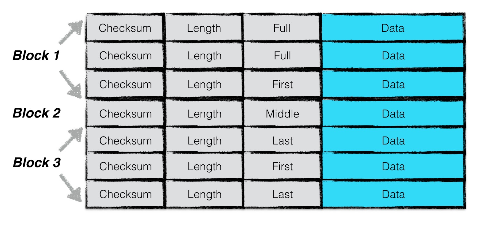

## 日志

为了防止写入内存的数据库因为进程异常、系统掉电等情况发生丢失，leveldb在写内存之前会将本次写操作的内容写入日志文件中。

在leveldb中，有两个memory db，以及对应的两份日志文件。其中一个memory db是可读写的，当这个db的数据量超过预定的上限时，便会转换成一个不可读的memory db，与此同时，与之对应的日志文件也变成一份frozen log。

而新生成的immutable memory db则会由后台的minor compaction进程将其转换成一个sstable文件进行持久化，持久化完成，与之对应的frozen log被删除。

在本文中主要分析日志的结构、写入读取操作。

### 日志结构

为了增加读取效率，日志文件中按照block进行划分，每个block的大小为32KiB。每个block中包含了若干个完整的chunk。

一条日志记录包含一个或多个chunk。每个chunk包含了一个7字节大小的header，前4字节是该chunk的校验码，紧接的2字节是该chunk数据的长度，以及最后一个字节是该chunk的类型。其中checksum校验的范围包括chunk的类型以及随后的data数据。

chunk共有四种类型：full，first，middle，last。一条日志记录若只包含一个chunk，则该chunk的类型为full。若一条日志记录包含多个chunk，则这些chunk的第一个类型为first, 最后一个类型为last，中间包含大于等于0个middle类型的chunk。

由于一个block的大小为32KiB，因此当一条日志文件过大时，会将第一部分数据写在第一个block中，且类型为first，若剩余的数据仍然超过一个block的大小，则第二部分数据写在第二个block中，类型为middle，最后剩余的数据写在最后一个block中，类型为last。

### 日志内容

日志的内容为**写入的batch编码后的信息**。

具体的格式为：

一条日志记录的内容包含：

* Header
* Data

其中header中有（1）当前db的sequence number（2）本次日志记录中所包含的put/del操作的个数。

紧接着写入所有batch编码后的内容。有关batch的编码规则，可以见《Leveldb源码解析 - 写操作》。

### 日志写

日志写入流程较为简单，在leveldb内部，实现了一个journal的writer。首先调用Next函数获取一个singleWriter，这个singleWriter的作用就是写入**一条journal记录**。

singleWriter开始写入时，标志着第一个chunk开始写入。在写入的过程中，不断判断writer中buffer的大小，若超过32KiB，将chunk开始到现在做为一个完整的chunk，为其计算header之后将整个block写入文件。与此同时reset buffer，开始新的chunk的写入。

若一条journal记录较大，则可能会分成几个chunk存储在若干个block中。

### 日志读

同样，日志读取也较为简单。为了避免频繁的IO读取，每次从文件中读取数据时，按block（32KiB）进行块读取。

每次读取一条日志记录，reader调用Next函数返回一个singleReader。singleReader每次调用Read函数就返回一个chunk的数据。每次读取一个chunk，都会检查这批数据的校验码、数据类型、数据长度等信息是否正确，若不正确，且用户要求严格的正确性，则返回错误，否则丢弃整个chunk的数据。

循环调用singleReader的read函数，直至读取到一个类型为Last的chunk，表示整条日志记录都读取完毕，返回。

